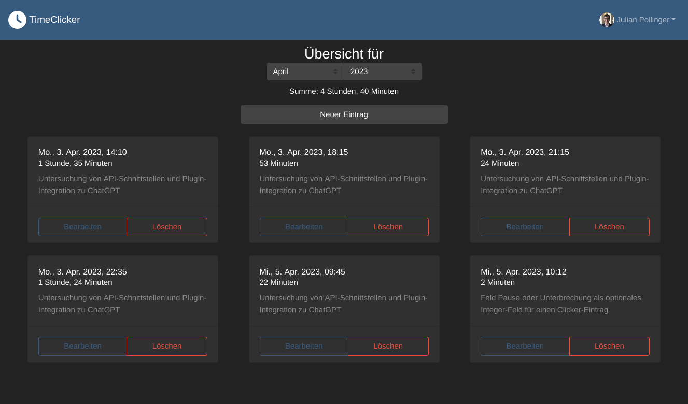

# Timeclicker
[](https://github.com/educorvi/timeclicker/actions/workflows/ci.yml)
[](https://github.com/educorvi/timeclicker/actions/workflows/docker.yml)
[](https://github.com/educorvi/timeclicker/actions/workflows/deploy.yml)

Timeclicker is a tool to log how many hours are used on which project.

## Interface
Timeclicker has a WebUI with German and English language support for entering your hours.

It also has a so called "orga" view for filtering and listing hours of all users.
This list can also be downloaded (or accessed via the API) for further processing, e. g. automatic invoice creation.

## Integration
### Tasks
The tasks that the users can work on are pulled from a configurable endpoint. The following format is expected:
```json
[
  {
    "id": "someId",
    "title": "Work on documentation",
    "note": false
  },
  {
    "id": "anotherID",
    "title": "Prepare talk",
    "note": false
  },
  {
    "id": "thisIdIsUnique",
    "title": "Meetings",
    "note": true
  }
]
```
- id: A unique ID
- title: The tasks title
- note: Is it mandatory for a user to specify a note? Useful for more broad tasks to let the user specify, what they did.

### Users
For user authentication and management this projects connects to Keycloak.


## Setup
In both directories `client` and `server` copy the file `.env.template` to `.env` and configure the settings to your wishes. `DB_PORT` and `DB_HOST` can be omitted for the docker variant.
### Docker
You can use the docker-compose file to start the Timeclicker and a database by running:
```bash
docker compose --env-file server/.env up
```
### Manual
```bash
yarn install
yarn run build
cd server
node dist/src/index.js
```
